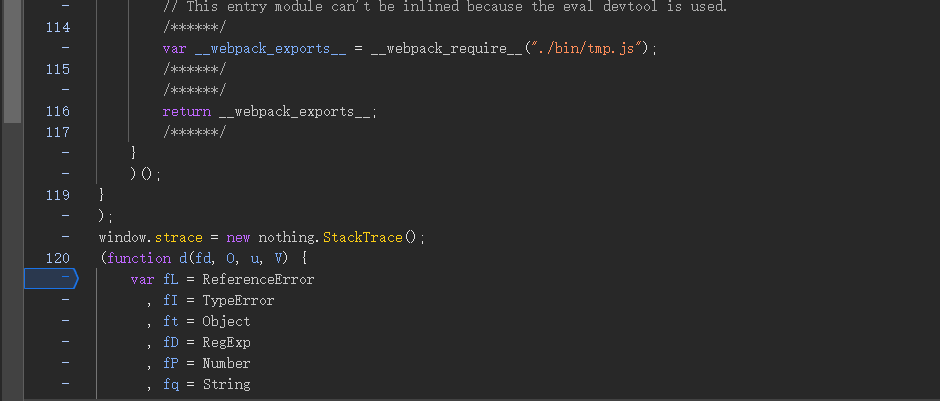
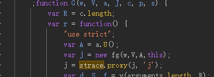

# 功能
代理 vm 的栈，可以保存大量日志，配有断点、下载日志等功能

# 用法
将 webpack 打包好的代码放到 jsvmp 所在文件的开头，然后 new 出一个 StackTrace 对象

找到 vm 的栈对象，代理它

# 代码
```js
import { Log } from "./Log"
import { TextStorage } from "./TextStorage";
import { stringify } from "./stringify";
import { proxy } from "./proxy";

class StackTrace
{
    public open: boolean;           // 开关
    public details: boolean;        // 详细代理日志
    public line: number;            // 日志行数
    public lengthLimit: number      // 单行长度限制

    public log: Log;                // 调试打印
    public textStorage: TextStorage // 日志的存储

    public proxy_map: Map<object, string>;  // 代理过的对象

    constructor(open=false, details=false, lengthLimit=50)
    {
        this.open = open;
        this.details = details;
        this.line = 0;
        this.lengthLimit = lengthLimit;

        this.log = new Log();
        this.textStorage = new TextStorage();

        this.proxy_map = new Map();
    }

    getType(target: any): string
    {
        if (Array.isArray(target)) return 'array';
        else if (target && target.buffer) return 'arraybuffer'; // target instanceof ArrayBuffer 不算在内
        else if (target == null)  return 'null';
    
        return typeof target;
    }

    stringify(variable: any): string
    {
        return stringify(variable, this.lengthLimit);
    }

    addContent(text: string, maxLine=10000)
    {
        this.textStorage.add(text + '\r\n');
        this.line += 1;

        if (this.line % maxLine == 0) 
        {
            this.log.debug(this.line + "");
            this.textStorage.blobStored();
        }
    }

    proxy(proxyObject: object, name: string, condition: Function = () => { return false })
    {
        let is_has = this.proxy_map.has(proxyObject);
        if (is_has) return proxyObject;
        else
        {
            let tmp = proxy(proxyObject, name, (name, mode, target, property, value) => {
                if (!this.open) return;
    
                if (mode != "set" && mode != "get") return;
                
                let content;
                let select;
                let text;
    
                if (this.details) select = target;
                else select = value;
    
                content = this.stringify(select);
                text = `${name}|${mode}| 下标: ${property.toString()} 内容: ${content}`;
                this.addContent(text, 10000);
                
                if (condition(this.line, name, mode, property.toString(), select, content)) debugger;
            });
            this.proxy_map.set(tmp, name);
            return tmp;
        }
    }

    download(fileName = '日志.txt')
    {
        this.textStorage.download(fileName);
        this.clear();
    }

    clear()
    {
        this.textStorage.clear();
        this.line = 0;
        this.open = false;
    }
}

export { StackTrace };
```